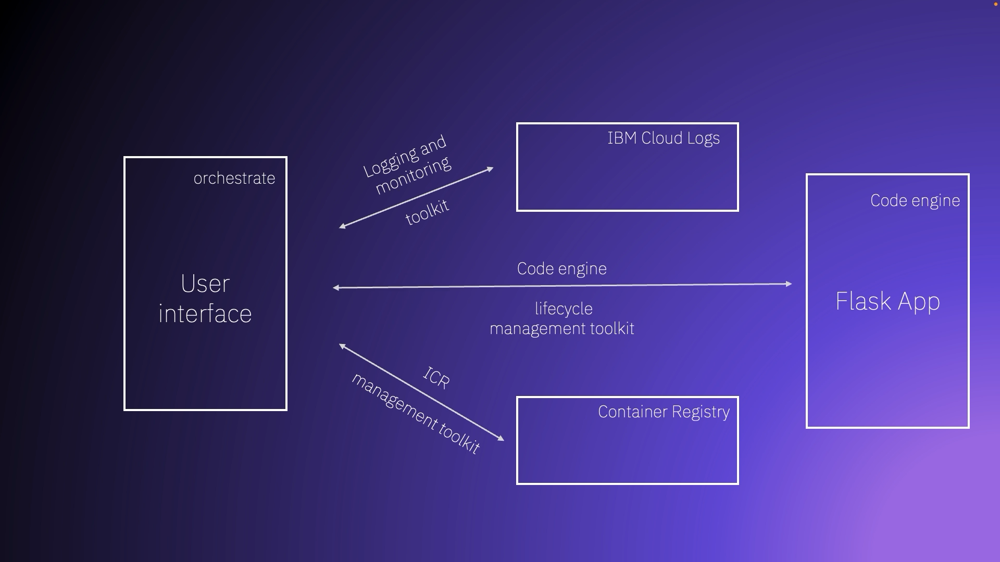

# IBM Cloud Toolkit for watsonx Orchestrate

MCP toolkit for watsonx Orchestrate with 14 tools covering Cloud Logs, Code Engine, Container Registry, service management, and resource operations.

## Demo Video

<a href="https://www.linkedin.com/posts/krishna-chaitanya-28ba69200_watsonxorchestrate-ibmcloud-aiagents-activity-7264609667725058048-WbZ7" target="_blank">
  
</a>

## Prerequisites

- [IBM Cloud CLI](https://cloud.ibm.com/docs/cli?topic=cli-getting-started) installed and configured
- [Watson Orchestrate CLI](https://developer.watson-orchestrate.ibm.com/tools/toolkits/local_mcp_toolkits) (`pip install ibm-watsonx-orchestrate`)
- IBM Cloud account with API key
- watsonx Orchestrate access

## Configuration

### 1. Setup Environment Variables

Copy `.env.example` to `.env` and configure:

```bash
cp .env.example .env
```

Required credentials in `.env`:

```bash
IBMCLOUD_API_KEY=your_api_key
IBMCLOUD_ACCOUNT_ID=your_account_id
IBMCLOUD_REGION=us-east
CODE_ENGINE_PROJECT_ID=your_project_id
CLOUD_LOGS_INSTANCE_ID=your_instance_id
CLOUD_LOGS_INSTANCE_GUID=your_instance_guid
CLOUD_LOGS_REGION=us-south
ORCHESTRATE_ENV=ibmcloud
```

**Getting credential IDs:**

```bash
# Account ID
ibmcloud account show

# Project ID
ibmcloud ce project list
ibmcloud ce project get --name your-project

# Cloud Logs Instance
ibmcloud resource service-instances --service-name logs
ibmcloud resource service-instance your-logs-instance --output json
```

### 2. Create Orchestrate Environment

```bash
orchestrate env create ibmcloud --api-key YOUR_API_KEY
orchestrate env activate ibmcloud --api-key YOUR_API_KEY
```

### 3. Deploy Toolkit

```bash
./deploy_orchestrate.sh
```

The script injects credentials from `.env`, deploys the toolkit, and cleans up automatically.

## Available Tools (14)

**Cloud Logs (2)**
- `get_app_logs` - Get Code Engine app logs
- `query_cloud_logs` - Query with DataPrime syntax

**Code Engine (8)**
- `get_app_status` - Get app status and config
- `scale_app` - Scale instances
- `update_app_memory` - Update memory allocation
- `restart_app` - Restart application
- `rebuild_app` - Rebuild and redeploy
- `list_services`, `create_service`, `bind_service`

**Container Registry (4)**
- `list_icr_namespaces` - List namespaces
- `list_icr_images` - List images
- `delete_icr_image` - Delete image
- `get_icr_quota` - Get quota/usage

**Resources (2)**
- `list_resource_groups` - List resource groups
- `target_resource_group` - Target a resource group

## Usage

In watsonx Orchestrate:

```
get_app_status app_name=memory-test-app
scale_app app_name=memory-test-app instances=3
update_app_memory app_name=memory-test-app memory=512M
query_cloud_logs query="source logs | filter severity >= 5" hours=1
list_icr_images namespace=testdeploy
```

## Memory Test App

Flask app for testing OOM scenarios:

**Endpoints:**
- `GET /` - Health check
- `POST /crash` - Immediate OOM (10GB)
- `POST /crash/gradual` - Gradual memory consumption
- `GET /memory` - Memory stats

**Deploy to Code Engine:**

```bash
cd src/app-toolkit/memory-test-app

ibmcloud ce build create --name memory-test-app \
  --source . \
  --image us.icr.io/testdeploy/memory-test-app:latest

ibmcloud ce app create --name memory-test-app \
  --image us.icr.io/testdeploy/memory-test-app:latest \
  --memory 512M --cpu 0.5
```
